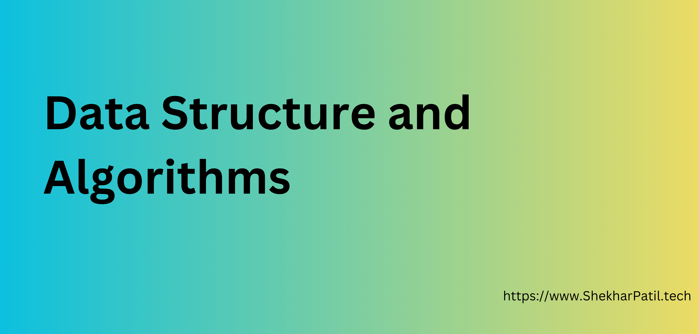

# Data Structures and Algorithms Roadmap

---

## 1. **Data Structures**

- Arrays _(Coming Soon)_
- [Linked Lists](data-structures/linked-list)
  - [Singly Linked Lists](data-structures/linked-list/singly-linked-list)
  - [Doubly Linked Lists](data-structures/linked-list/doubly-linked-list)
  - [Circular Linked Lists](data-structures/linked-list/circular-linked-list)
- [Stacks](data-structures/stack)
- Queues _(Coming Soon)_
- Trees
  - [General Trees](data-structures/tree/general-tree)
  - Binary Trees _(Coming Soon)_
  - Binary Search Trees _(Coming Soon)_
- Graphs
  - Directed Graphs _(Coming Soon)_
  - Undirected Graphs _(Coming Soon)_
- Hash Tables _(Coming Soon)_
- Heaps
  - Min-Heap _(Coming Soon)_
  - Max-Heap _(Coming Soon)_
- Trie _(Coming Soon)_

---

## 2. **Sorting Algorithms**

- [Bubble Sort](sorting-algorithms/bubble-sort)
- [Selection Sort](sorting-algorithms/selection-sort)
- [Insertion Sort](sorting-algorithms/insertion-sort)
- [Merge Sort](sorting-algorithms/merge-sort)
- [Quick Sort](sorting-algorithms/quick-sort)
- Heap Sort _(Coming Soon)_
- Counting Sort _(Coming Soon)_
- Radix Sort _(Coming Soon)_
- Topological Sort _(Coming Soon)_

---

## 3. **Searching Algorithms**

- [Linear Search](searching-algorithms/linear-search)
- [Binary Search](searching-algorithms/binary-search)
- Exponential Search _(Coming Soon)_
- Ternary Search _(Coming Soon)_

---

## 4. **Graph Algorithms**

- Depth-First Search (DFS) _(Coming Soon)_
- Breadth-First Search (BFS) _(Coming Soon)_
- [Prim's Algorithm](graph-algorithms/prims-algorithm)
- [Dijkstra's Algorithm](graph-algorithms/dijkstra-algorithm)
- Bellman-Ford Algorithm _(Coming Soon)_
- Kruskal's Algorithm _(Coming Soon)_
- Floyd-Warshall Algorithm _(Coming Soon)_
- Union-Find / Disjoint Set Union (DSU) _(Coming Soon)_
- Tarjan’s Algorithm _(Coming Soon)_
- Kosaraju’s Algorithm _(Coming Soon)_

---

## 5. **Dynamic Programming Algorithms**

- [Kadane's Algorithm](dynamic-programming/kandanes-algorithm)
- 0/1 Knapsack _(Coming Soon)_

---

## 6. **Greedy Algorithms**

- Activity Selection _(Coming Soon)_
- Huffman Coding _(Coming Soon)_
- Fractional Knapsack _(Coming Soon)_
- Job Sequencing _(Coming Soon)_
- Egyptian Fraction _(Coming Soon)_

---

## 7. **Backtracking Algorithms**

- N-Queens Problem _(Coming Soon)_
- Sudoku Solver _(Coming Soon)_
- Rat in a Maze _(Coming Soon)_
- Word Search _(Coming Soon)_
- Subset Generation _(Coming Soon)_
- Permutation Generation _(Coming Soon)_

---

## 8. **Bit Manipulation Algorithms**

- Count Set Bits _(Coming Soon)_
- Check Power of Two _(Coming Soon)_
- XOR of All Numbers in Range _(Coming Soon)_
- Find Missing Number _(Coming Soon)_
- Find Two Non-Repeating Elements _(Coming Soon)_

---

## 9. **String Algorithms**

- Naive Pattern Matching _(Coming Soon)_
- Rabin-Karp Algorithm _(Coming Soon)_
- Knuth-Morris-Pratt (KMP) Algorithm _(Coming Soon)_
- Z-Algorithm _(Coming Soon)_
- Longest Palindromic Substring _(Coming Soon)_
- Anagram Check _(Coming Soon)_
- Manacher’s Algorithm _(Coming Soon)_
- Suffix Array & Suffix Tree _(Coming Soon)_

---

## 10. **Miscellaneous Must-Know Algorithms**

- Sliding Window Technique _(Coming Soon)_
- Two Pointer Technique _(Coming Soon)_
- Fast & Slow Pointers (Cycle Detection) _(Coming Soon)_
- Reservoir Sampling _(Coming Soon)_
- Fisher-Yates Shuffle _(Coming Soon)_
- Boyer-Moore Majority Voting _(Coming Soon)_
